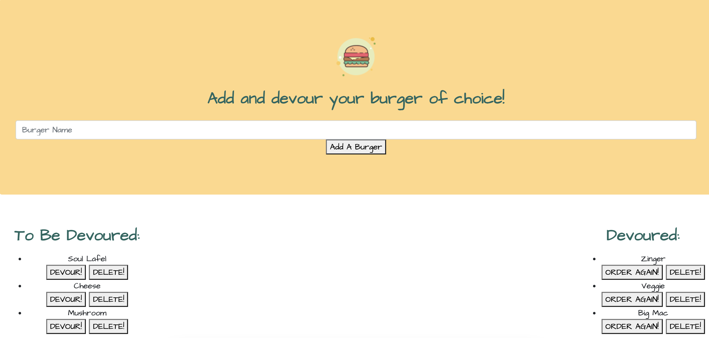

# Burger-Yum 🍔

### [Heroku](https://protected-refuge-48581.herokuapp.com/)
### [GitHub](https://ffakih5.github.io/Burger-Yum/)

 This is an application for all the burger lovers out there. To interact with Burger-Yum, simply enter a burger of your choice, either devour it in the moment or savour it for later, then delete or reorder it! Enjoy as many burgers as you wish! 😋

## Made with
- Node 
- Express
- JavaScript
- Handlebars
- HTML
- CSS
- SQL

## To launch app from your terminal

_Enter the command node server.js_

